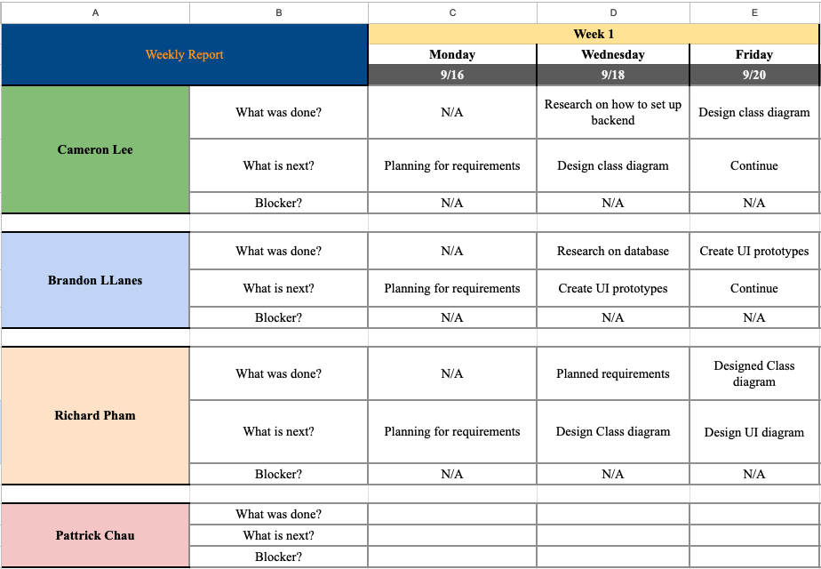
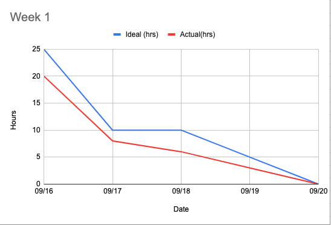
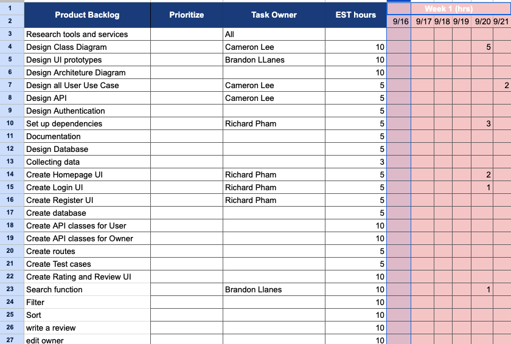
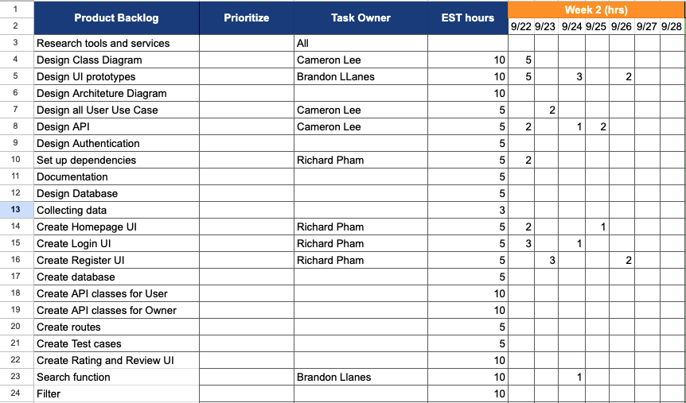
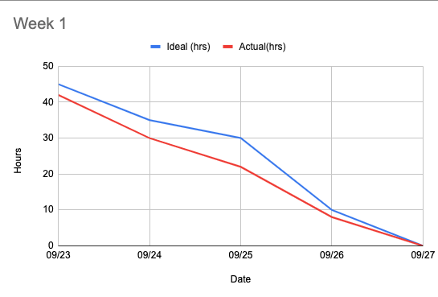
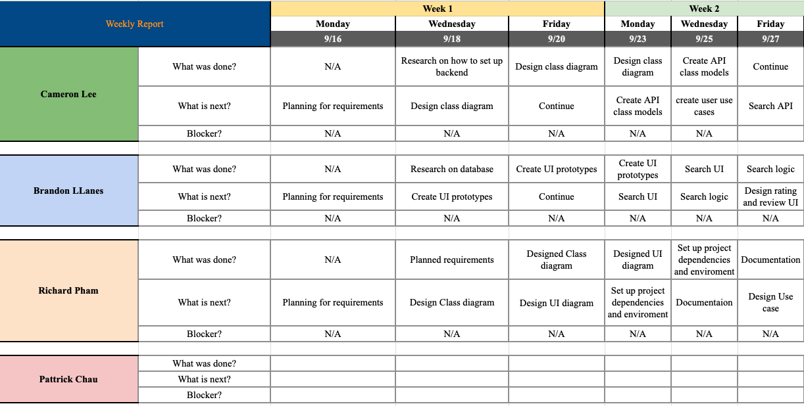

# Foodie

## [Link to Github](https://github.com/gopinathsjsu/team-project-cmpe202_fall24_foodie)

## Team member

Frontend:
Backend:

## Team Contribution Summary

## Features

    1. Register user
    2. View user profile
    3. Login as Business owner
    5. Login as user
    6. Logout
    7. Search for restaurants by name, categories
    8. Search for restaurants by location
    8. Submit Reviews and Ratings
    9. View details
    10. Add new listing as owner
    11. Update restaurant info as owner
    12. Add/Update descriptions, photos as owner
    13. View restaurant chains list owned as owner
    14. Delete restaurant

## WireFrame:

## Notes:

Frontend 1. Install Node.js 2. Go into frontend directory 3. Install npm dependencies: npm install 4. Start frontend server: npm run dev

    Deploy

### Sprint Notes

Meeting every MWF

1. Sprint Meeting 1 (09/20):
   We planned to split the app into 2 parts: front end interface (ReactJS) and backend API(Java Spring Boot). We decided to start with some UI designs on Figma and set up the project including dependiences and tools.

2. Sprint Meeting 2 (09/23, 25, 27):
   On this sprint, we focus on designing the rest of the system and start implementing basic functions for the front end and back end.

3. Sprint Meeting 3 (09/30, 10/2, 4):
   Sprint 3 we focus on setting authentication UI page and homepage, continuing setting up the backend and a few API endpoints so the frontend can call and integrate with the backend. More business rules and user models are created.

### SCRUM Task Sheets

1. Sprint 1

- Backlog
  
- Burndown Chart
  
- Weekly report
  

2. Sprint 2

- Backlog
  
- Burndown Chart
  
- Weekly report
  

3. Sprint 3

- Backlog
- Burndown Chart
- Weekly report

4. Sprint 4

- Backlog
- Burndown Chart
- Weekly report

### XP Core Value

1. Communication
   Communication was one of the key strengths of our team. We held meetings every Monday, Wednesday, and Friday, ensuring regular touchpoints to stay aligned. During these meetings, we discussed challenges, reviewed our progress, and planned the next steps. This structure ensured that everyone was on track and had a clear understanding of their tasks. If team members encountered any issues or needed assistance, we encouraged them to reach out through Discord for quick chats or calls.

2. Feedback
   We prioritized providing feedback during our sprint meetings. By addressing issues early, we minimized recurring mistakes and improved overall productivity. Additionally, we conducted thorough code reviews at the end of each sprint. This practice helped ensure that all changes were well-documented, error-free, and ready to merge into the master branch without risking production stability.

### Diagrams

